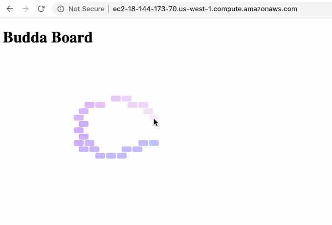

# Config as code

Play around with config as code. Setup to minimize steps to publish public website.

Use [Terraform](https://www.terraform.io/docs/) to provision my "infrastructure" (single AWS ec2), [Ansible](https://docs.ansible.com/ansible/latest/user_guide/playbooks_best_practices.html#directory-layout) for configuration ([Nginx](https://docs.nginx.com/nginx/admin-guide/web-server/web-server/) reverse proxy on "web" ec2), deployment mechanism to publish "web app" (static site).

Some goals to balance for this project:
 - always be automating, from the start
 - start basic & only make "good enough" while progressing (i.e. static site first, web-app framework later)
 - minimize learning DSL/"config syntax" (i.e. don't use 3rd party dependency if not critical)
 - keep manageable (i.e. scalable, & as if team members with different roles contribute)

## The place holder site is really fun to play with:

## Usage

- AWS account and user setup required
- run terraform apply command (obtain ec2)
- manually edit repo to target ec2 instance via ansible & deploy script
- run ansible web playbook (start Nginx)
- run bash deploy script (deploy site)

## Considerations encountered
(parden my typeos)

- There are sooo many ways to skin this cat (publish static site), it's overwhelming. From bash everything, competing cloud providers, terraform vs cloud formation vs pulumi vs Ansible vs AWS AMI's vs docker vs github pages vs ...  *Everyone is offering everything evolving-ly*. It's like staying up-to-date on all things javascript.
- *Devops is all user management.* Difficult to keep different user contexts strait, esp while coding the right stuff via new DSL's. AWS AMI users/roles, users in an ec2, different real life user roles interacting with this repo, ect..
- It was nice to start basic & practice adding only what's required. It removes thinking about a framework's complexity and reinforces how parts are integrated with each other
- I thought Terraform would have provider agnostic syntax, but not the case. If so, then why use it vs cloud formation? My colleague informs terraform just does a good job and with solid community. And at least, terraform shares *some* syntax/conventions for coding up different providers.
- vinilla css is a good refresher, and prompts side quests like, "What exactly is [babel](https://babeljs.io/) and [webpack](https://webpack.js.org/)? What are scenarios where I'd use one or both?"
- Forgot how much js frameworks hold your hand. Frameworks are great, but will dull your knowledge/power if you interact with them only as an agile code monkey.
- When you actually need to implement deploying, it's rewarding to run through paces of evaluating different solutions. (bash vs capistrano vs ansible vs terraform vs ...) The current bash script here requires manually hard coding target machines : /
- Ansible supports terraform, and terraform supports ansible, how to use which when?!
- Nginx: preinstalled on AWS AMI vs official ansible galaxy role vs different manual config conventions? Nginx itself offers a suite of products. Which do I need when?!
- TIL [gitignore repo helpful](https://github.com/github/gitignore)
- the repo's dummy "budda board" site is quite fun to play with, changing shapes, looping colors in order, fading tiles, tweaking the knobs, ect..
- Need to sharpen my js. It's a hodgepodge here
